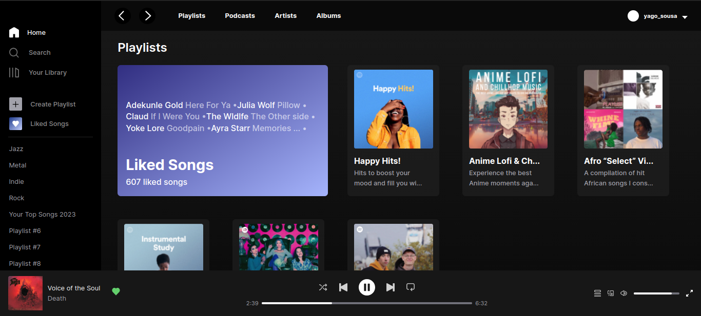

<h1>UI Clone do Spotify</h1>

Testando meus conhecimentos com ReactJS e TailwindCSS

## Preview

    
  

### 👨‍💻 Tecnologias

Esse projeto foi desenvolvido com as seguintes tecnologias:

- ReactJS
- TailwindCSS
- Figma

    by Yago.

